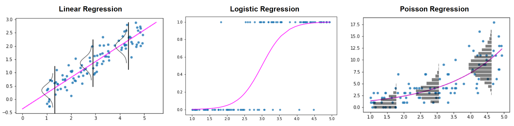

# **Generalized Linear Models** (GLM)
In this repository I delve into three different types of regression.

    

## 📖 **About**
This is a collection of end-to-end regression problems. Topics are introduced theoretically in the `README.md` and tested practically in the notebooks linked below.

First, I tested the theory on toy simulations. I made four different simulations in `python`, taking advantage of the `sklearn` and `statsmodels` libraries:
* [GLM Simulation pt. 1 - **Linear Regression**](https://github.com/PaulinoMoskwa/GLMs/blob/master/1.%20Simulations/GLM%20pt.%201%20-%20Linear%20Regression.ipynb)
* [GLM Simulation pt. 2 - **Logistic Regression**](https://github.com/PaulinoMoskwa/GLMs/blob/master/1.%20Simulations/GLM%20pt.%202%20-%20Logistic%20Regression.ipynb)
* [GLM Simulation pt. 3 - **Poisson Regression**](https://github.com/PaulinoMoskwa/GLMs/blob/master/1.%20Simulations/GLM%20pt.%203%20-%20Poisson%20Regression.ipynb)
* [GLM Simulation pt. 4 - **Customized Regression**](https://github.com/PaulinoMoskwa/GLMs/blob/master/1.%20Simulations/GLM%20pt.%204%20-%20Customized%20Regression.ipynb)

After that I moved onto some real-world-data cases, developing three different end-to-end projects:
* **Linear Regression** - Human brain weights
    * [Exploratory Data Analysis (EDA)](https://github.com/PaulinoMoskwa/GLMs/blob/master/2.%20Linear%20Regression/1.%20Exploratory%20Data%20Analysis%20(EDA).ipynb)
    * [Feature Selection](https://github.com/PaulinoMoskwa/GLMs/blob/master/2.%20Linear%20Regression/2.%20Feature%20Selection.ipynb)
    * [Linear Regression with `sklearn`](https://github.com/PaulinoMoskwa/GLMs/blob/master/2.%20Linear%20Regression/3.%20Linear%20Regression%20with%20Scikit-Learn.ipynb)
    * [Linear Regression with `statsmodels`](https://github.com/PaulinoMoskwa/GLMs/blob/master/2.%20Linear%20Regression/4.%20Linear%20Regression%20with%20Statsmodels.ipynb)
    * [Advanced Regression techniques with `sklearn`](https://github.com/PaulinoMoskwa/GLMs/blob/master/2.%20Linear%20Regression/5.%20Advanced%20Regression%20techniques%20with%20Scikit-Learn.ipynb)
* **Logistic Regression** - HR dataset
    * [Exploratory Data Analysis (EDA)](https://github.com/PaulinoMoskwa/GLMs/blob/master/3.%20Logistic%20Regression/1.%20Exploratory%20Data%20Analysis%20(EDA).ipynb)
    * [Feature Selection](https://github.com/PaulinoMoskwa/GLMs/blob/master/3.%20Logistic%20Regression/2.%20Feature%20Selection.ipynb)
    * [Logistic Regression with `sklearn`](https://github.com/PaulinoMoskwa/GLMs/blob/master/3.%20Logistic%20Regression/3.%20Logistic%20Regression%20with%20Scikit-Learn.ipynb)
    * [Logistic Regression with `statsmodels`](https://github.com/PaulinoMoskwa/GLMs/blob/master/3.%20Logistic%20Regression/4.%20Logistic%20Regression%20with%20Statsmodels.ipynb)
* **Poisson Regression** - Smoking and lung cancer
    * [Exploratory Data Analysis (EDA)](https://github.com/PaulinoMoskwa/GLMs/blob/master/4.%20Poisson%20Regression/1.%20Exploratory%20Data%20Analysis%20(EDA).ipynb)
    * [Feature Selection](https://github.com/PaulinoMoskwa/GLMs/blob/master/4.%20Poisson%20Regression/2.%20Feature%20Selection.ipynb)
    * [Poisson Regression with `sklearn`](https://github.com/PaulinoMoskwa/GLMs/blob/master/4.%20Poisson%20Regression/3.%20Poisson%20Regression%20with%20Scikit-Learn.ipynb)
    * [Poisson Regression with `statsmodels`](https://github.com/PaulinoMoskwa/GLMs/blob/master/4.%20Poisson%20Regression/4.%20Poisson%20Regression%20with%20Statsmodels.ipynb)

Further details can be found in the 'Practical Examples' section below in this `README.md`.

*Note.* A good [dataset resource](https://data.princeton.edu/wws509/datasets) for linear regression, logistic regression, poisson regression, multinomial responses, survival data. 
*Note.* To further explore feature selection: [source 1](https://machinelearningmastery.com/rfe-feature-selection-in-python/), [source 2](https://scikit-learn.org/stable/modules/feature_selection.html#feature-selection), [source 3](https://scikit-learn.org/stable/modules/classes.html#module-sklearn.feature_selection), [source 4](https://towardsdatascience.com/feature-selection-for-the-lazy-data-scientist-c31ba9b4ee66), [source 5](https://towardsdatascience.com/learn-how-to-do-feature-selection-the-right-way-61bca8557bef).

## 📚 **Theoretical Overview** 
A generalized linear model (GLM) is a flexible generalization of ordinary linear regression. The GLM generalizes linear regression by allowing the linear model to be related to the response variable via a *link function*. In a generalized linear model, the outcome $\boldsymbol{Y}$ (dependent variable) is assumed to be generated from a particular distribution in a family of exponential distributions (e.g. Normal, Binomial, Poisson, Gamma). The mean $\boldsymbol{\mu}$ of the distribution depends on the independent variables $\boldsymbol{X}$ through the relation $(1)$: 

$
\begin{align}
   \mathbb{E}[\boldsymbol{Y}|\boldsymbol{X}] = \boldsymbol{\mu} = g^{-1}(\boldsymbol{X}\,\boldsymbol{\beta})
\end{align}
$

where $\mathbb{E}[\boldsymbol{Y}|\boldsymbol{X}]$ is the expected value of $\boldsymbol{Y}$ conditioned to $\boldsymbol{X}$, $\boldsymbol{X}\,\boldsymbol{\beta}$ is the linear predictor and $g(\cdot)$ is the link function. The unknown parameters $\boldsymbol{\beta}$ are typically estimated with maximum likelihood and [IRLS techniques](https://en.wikipedia.org/wiki/Iteratively_reweighted_least_squares).

🟥 *For the sake of clarity, from now on we consider the case of the ***scalar*** outcome, $Y$.*

Every GLM consists of three elements:
1. a distribution (from the family of exponential distributions) for modeling $Y$
2. a linear predictor $\boldsymbol{X}\,\boldsymbol{\beta}$
3. a link function $g(\cdot)$ such that $\mathbb{E}[\boldsymbol{Y}|\boldsymbol{X}] = \boldsymbol{\mu} = g^{-1}(\boldsymbol{X}\,\boldsymbol{\beta})$

The following are the most famous/used examples.

|Distribution|Support|Typical uses|$\mu=\mathbb{E}[Y\|\boldsymbol{X}]$|Link function  $\boldsymbol{X}\,\boldsymbol{\beta} = g(\mu)$|Link name|Mean function|
|:-|:-|:-|:-:|:-|:-|:-|
|Normal $(\mu,\sigma^2)$|$(-\infty, \infty)$|Linear-response data|$\mu$|$\boldsymbol{X}\,\boldsymbol{\beta} = \mu$|Identity|$\mu = \boldsymbol{X}\,\boldsymbol{\beta}$|
|Gamma $(\mu,\nu)$|$(0,\infty)$|Exponential-response data|$\mu$|$\boldsymbol{X}\,\boldsymbol{\beta} = -\mu^{-1}$|Negative inverse|$\mu = -(\boldsymbol{X}\,\boldsymbol{\beta})^{-1}$|
|Inverse-Gaussian $(\mu,\sigma^2)$|$(0, \infty)$||$\mu$|$\boldsymbol{X}\,\boldsymbol{\beta} = \mu^{-2}$|Inverse squared|$\mu = (\boldsymbol{X}\,\boldsymbol{\beta})^{-1/2}$|
|Poisson $(\mu)$|$\{0, 1, 2, ..\}$|Count of occurrences in a fixed  amount of time/space|$\mu$|$\boldsymbol{X}\,\boldsymbol{\beta} = \ln(\mu)$|Log|$\mu = \exp(\boldsymbol{X}\,\boldsymbol{\beta})$|
|Bernoulli $(\mu)$|$\{0, 1\}$|Outcome of single yes/no occurrence|$\mu$|$\boldsymbol{X}\,\boldsymbol{\beta} = \ln(\frac{\mu}{1-\mu})$|Logit|$\mu = \frac{1}{1+\exp(-\boldsymbol{X}\,\boldsymbol{\beta})}$|
|Binomial $(n, \mu)$|$\{0, 1, .., n\}$|Count of yes/no in $n$ occurrences|$n\,\mu$|$\boldsymbol{X}\,\boldsymbol{\beta} = \ln(\frac{\mu}{1-\mu})$|Logit|$\mu = \frac{1}{1+\exp(-\boldsymbol{X}\,\boldsymbol{\beta})}$|

## 📂 **Practical Examples**
As already mentioned, let $Y$ be the outcome (dependent variable) and let $\boldsymbol{X}$ be the independent variables. The three types of regression I analyzed (*Linear*, *Logistic* and *Poisson*) differ in the nature of $Y$. For each type, I collected an ad-hoc dataset to experiment with. 

------------------------

### 📑 **Linear Regression**
In the case of linear regression $Y$ is a real number and it is modeled as:

$\qquad\begin{cases}
    \;Y\sim N(\mu,\sigma^2)\\
    \;\mu = \boldsymbol{X}\,\boldsymbol{\beta}
\end{cases}$

As a case study for linear regression i analyzed a dataset of human brain weights.
* [Exploratory Data Analysis (EDA)](https://github.com/PaulinoMoskwa/GLMs/blob/master/2.%20Linear%20Regression/1.%20Exploratory%20Data%20Analysis%20(EDA).ipynb)
* [Feature Selection](https://github.com/PaulinoMoskwa/GLMs/blob/master/2.%20Linear%20Regression/2.%20Feature%20Selection.ipynb)
* [Linear Regression with `sklearn`](https://github.com/PaulinoMoskwa/GLMs/blob/master/2.%20Linear%20Regression/3.%20Linear%20Regression%20with%20Scikit-Learn.ipynb)
* [Linear Regression with `statsmodels`](https://github.com/PaulinoMoskwa/GLMs/blob/master/2.%20Linear%20Regression/4.%20Linear%20Regression%20with%20Statsmodels.ipynb)
* [Advanced Regression techniques with `sklearn`](https://github.com/PaulinoMoskwa/GLMs/blob/master/2.%20Linear%20Regression/5.%20Advanced%20Regression%20techniques%20with%20Scikit-Learn.ipynb)

------------------------

### 📑 **Logistic Regression**
In the case of logistic regression $Y$ is a categorical value ($0$ or $1$) and it is modeled as:

$\qquad\begin{cases}
    \;Y \sim Bernoulli(\mu)\\
    \;\log(\frac{\mu}{1-\mu}) = \boldsymbol{X}\,\boldsymbol{\beta}
\end{cases}$

As a case study for logistic regression i analyzed an HR dataset.
* [Exploratory Data Analysis (EDA)](https://github.com/PaulinoMoskwa/GLMs/blob/master/3.%20Logistic%20Regression/1.%20Exploratory%20Data%20Analysis%20(EDA).ipynb)
* [Feature Selection](https://github.com/PaulinoMoskwa/GLMs/blob/master/3.%20Logistic%20Regression/2.%20Feature%20Selection.ipynb)
* [Logistic Regression with `sklearn`](https://github.com/PaulinoMoskwa/GLMs/blob/master/3.%20Logistic%20Regression/3.%20Logistic%20Regression%20with%20Scikit-Learn.ipynb)
* [Logistic Regression with `statsmodels`](https://github.com/PaulinoMoskwa/GLMs/blob/master/3.%20Logistic%20Regression/4.%20Logistic%20Regression%20with%20Statsmodels.ipynb)

For *Advanced Classification techniques with Scikit-Learn* check out [Breast Cancer: End-to-End Machine Learning Project](https://github.com/PaulinoMoskwa/Breast-Cancer).

------------------------

### 📑 **Poisson Regression**
In the case of poisson regression $Y$ is a positive integer (count) and it is modeled as:

$\qquad\begin{cases}
    \;Y \sim Poisson(\mu)\\
    \;\log(\mu) = \boldsymbol{X}\,\boldsymbol{\beta}
\end{cases}$

As a case study for poisson regression i analyzed a dataset of smoking and lung cancer.
* [Exploratory Data Analysis (EDA)](https://github.com/PaulinoMoskwa/GLMs/blob/master/4.%20Poisson%20Regression/1.%20Exploratory%20Data%20Analysis%20(EDA).ipynb)
* [Feature Selection](https://github.com/PaulinoMoskwa/GLMs/blob/master/4.%20Poisson%20Regression/2.%20Feature%20Selection.ipynb)
* [Poisson Regression with `sklearn`](https://github.com/PaulinoMoskwa/GLMs/blob/master/4.%20Poisson%20Regression/3.%20Poisson%20Regression%20with%20Scikit-Learn.ipynb)
* [Poisson Regression with `statsmodels`](https://github.com/PaulinoMoskwa/GLMs/blob/master/4.%20Poisson%20Regression/4.%20Poisson%20Regression%20with%20Statsmodels.ipynb)

------------------------

## ⚖️ **Python `sklearn` vs. `statsmodels`**
What libraries should be used? In general, scikit-learn is designed for machine-learning, while statsmodels is made for rigorous statistics. Both libraries have their uses. Before selecting one over the other, it is best to consider the purpose of the model. A model designed for prediction is best fit using scikit-learn, while statsmodels is best employed for explanatory models. To completely disregard one for the other would do a great disservice to an excellent Python library.

To summarize some key differences:
* *OLS efficiency*: scikit-learn is faster at linear regression, the difference is more apparent for larger datasets
* *Logistic regression efficiency*: employing only a single core, statsmodels is faster at logistic regression
* *Visualization*: statsmodels provides a summary table
* *Solvers/methods*: in general, statsmodels provides a greater variety
* *Logistic Regression*: scikit-learn regularizes by default while statsmodels does not
* *Additional linear models*: scikit-learn provides more models for regularization, while statsmodels helps correct for broken OLS assumptions

